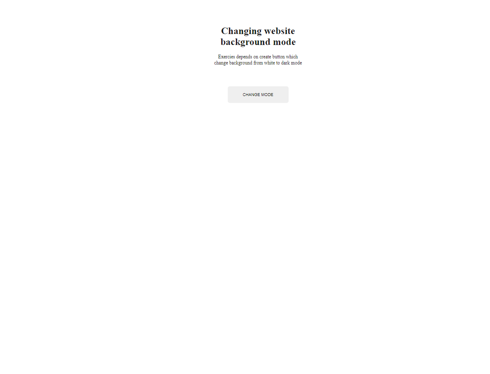
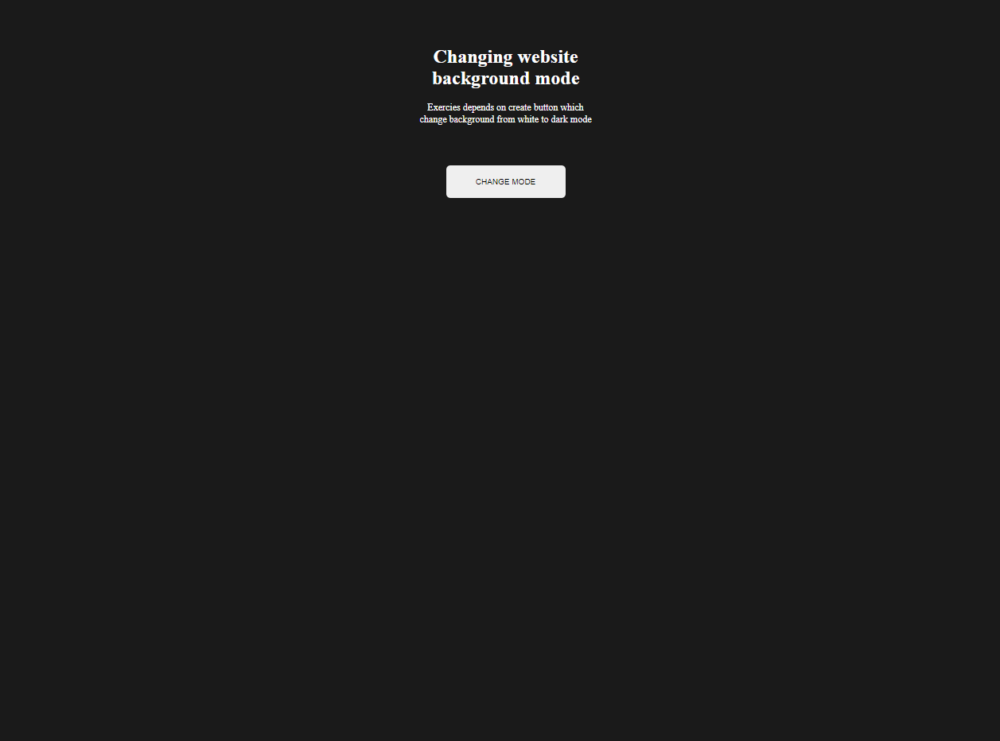

# CHANGE WEBSITE TO DARK MODE

## It is simple button with one functionality which change background mode from one color to another.

Main colour in **CSS**. I added with variables in body selector.
I used **JavaScript** to create function with change main colors.

### You may use this functionality in your webpage or application to changing background color to dark mode or other color you want.

### MAIN MODE

### BACKGROUND AFTER CLICK BUTTON

